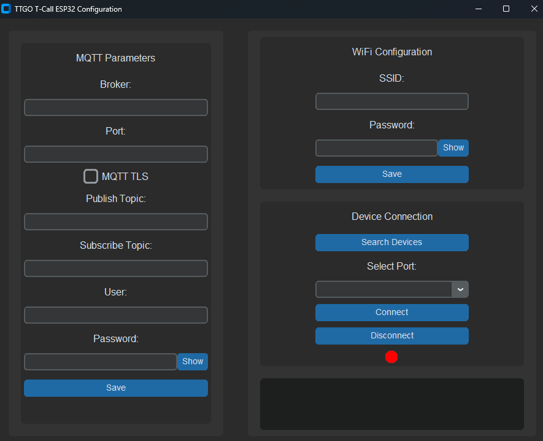

**GUI-Configurator-ESP32** is a graphical application designed for configuring ESP32 devices (or other devices that support serial communication) through a user-friendly interface. The app allows users to set various parameters, send custom JSON data fields over a serial connection, and includes a built-in serial monitor for debugging purposes.



## Key Features

- **ESP32/Device Configuration**: Connect to an ESP32 or other devices via serial communication and configure parameters such as Wi-Fi settings, MQTT broker information, etc.
- **Custom Data Fields**: Send data in JSON format through the serial connection to configure the device.
- **Serial Monitor**: View the real-time communication between the app and the device for debugging.
- **TLS Support**: Configure and send MQTT TLS options, including CA certificates.

## How to Use

### Prerequisites

- Python 3.x
- Virtual environment setup (optional but recommended for development)
- Required Python libraries: `pyinstaller`, `customtkinter`, `pyserial`

### Quick Start for Debugging

To quickly test or debug the app:

1. **Modify `app.py`**: Edit the `app.py` file to change the app's behavior, appearance, or functionality.
2. **Run the app**:
3. 
     ```bash
     python app.py
     ```

### Creating an Executable for Windows

To package the app into a standalone executable for distribution:

1. **Ensure the following files are in your project directory**:
   - `app.py`: The main application script.
   - `logo.ico`: The icon for the executable.
   - `build.bat`: The script for automating the build process.

2. **Run the build script**:
   - Open **Command Prompt** or **PowerShell**.
   - Navigate to the project directory.
   - Run the following command to build the executable:


     ```cmd
     .\build.bat
     ```


3. **Find the Executable**:
   The standalone executable will be located in the `dist/` folder within your project directory. You can move or share this executable without requiring Python or additional dependencies on the target machine.


